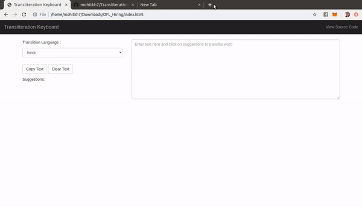

# Transliteration-Keyboard
A smart keyboard which suggest transliterations of an English phrase to a specific Indian language

### How to Use ?

 - Download the source code and unzip in your local machine.
 - Open `index.html` in browser of your choice. 
- Start typing in textarea provided, and click on suggestions to replace word by transliterated word.
- Default  transliteration language is `hindi`, you can change it using `select language` dropdown.
- You may also copy text and clear text using button provided.

### Demo

### Features
- Caches response of API, which avoids recall of API for word which is already transliterated.
- Options to copy and clear text.
- Bootstrap based responsive interface.
- Store transliteration language in local storage so it persists across reloads.

### Technologies Used 
HTML, CSS, Javascript, Angular.js, Jquery, Bootstrap
